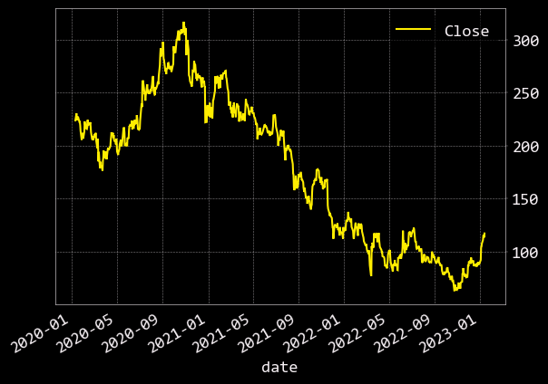

#### We will analize and explain all the technical indicators using the Alibaba Group Holding Ltd stock (BABA):

1- [SMA (Simple Moving Average)](./SMA/)
###### SMA (Simple Moving Average) is a technical indicator that shows the average value of a security's price over a period of time. It's calculated by adding the closing price of a security for a number of time periods and then dividing this total by the number of time periods. It's used to identify trends, support and resistance levels.

2- [EMA (Exponential Moving Average)](./EMA/)
###### EMA (Exponential Moving Average) is a technical indicator that shows the average value of a security's price over a period of time, but gives more weight to recent prices. It's calculated by applying a percentage weighting to the most recent price, where the weighting decreases exponentially with each previous period. EMA is used to identify trends, support and resistance levels in a similar way as SMA.

3- [WMA (Weighted Moving Average)](./WMA/)
###### WMA (Weighted Moving Average) is a type of moving average that assigns different weights to the data points used to calculate the average. The most recent data points are given more weight, while older data points are given less weight.

###### For example, if a WMA has a period of 20, it would use the last 20 data points to calculate the average, but the most recent data point would have a higher weight than the oldest data point.

###### WMA is generally used to reduce the lag time in moving averages and make the average more responsive to recent price changes. It is particularly useful in identifying short-term trends and making more accurate predictions about future price movements.

###### WMA is similar to EMA (Exponential Moving Average) in that both assign more weight to recent data points, but the way the weight is assigned is different. EMA uses an exponential decay factor to assign weight to data points, while WMA assigns weights based on a linear weighting scheme.

